### Hash 479 points

Let's start out by importing this file into ghidra
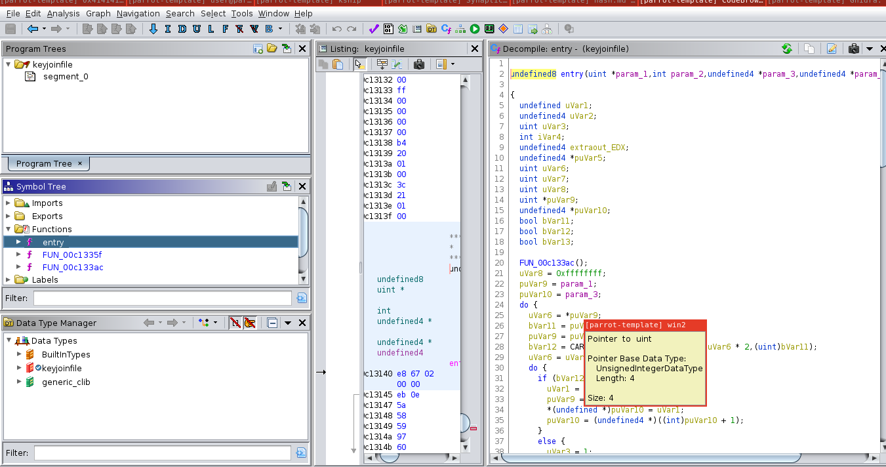
This looks very messy.....could it be packed/obfuscated somehow?
Running the command strings, it's clear that the file was packed with UPX.
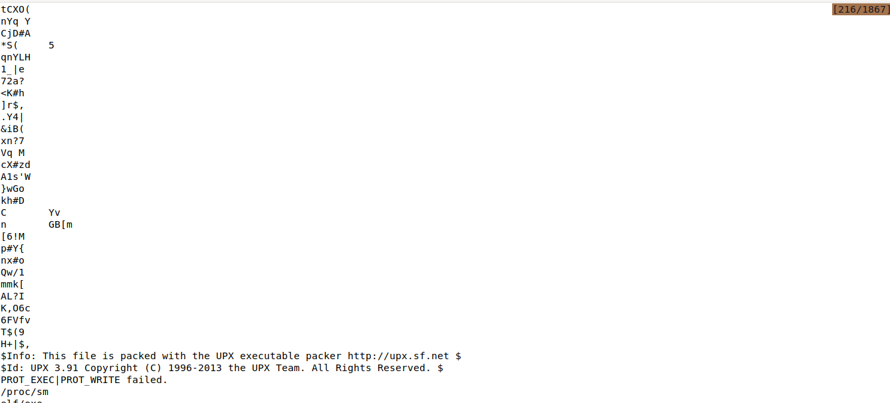

After unpacking this with the command ```upx -d (filename)```
main() becomes much easier to read
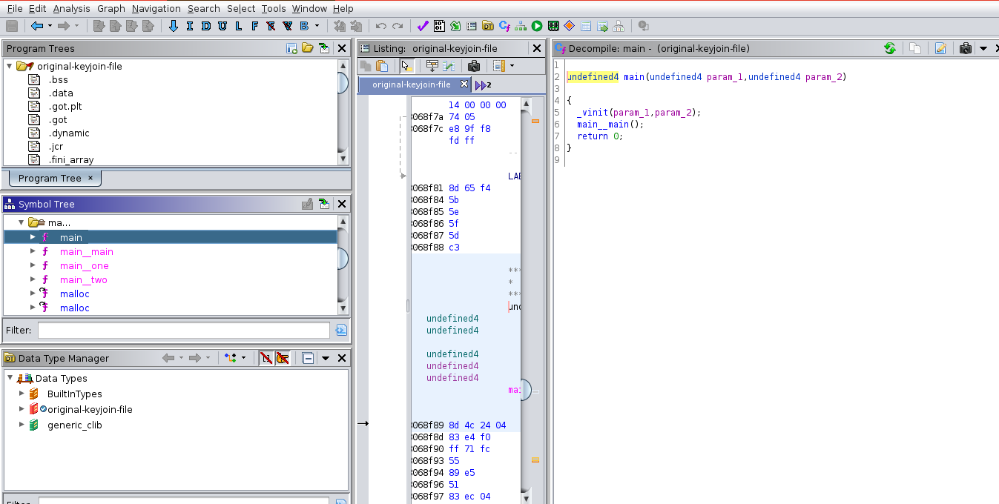
But, going to main__main(), all that appears to be going on is
that 2 failure messages are printed out.
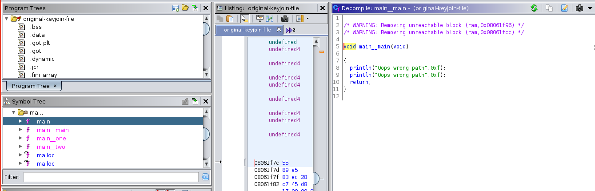

Go to the assembly listing of main__main.
There's a comparison being made (0x17 to 0x2d) that will never be equal, which jumps 
to the fail branch.
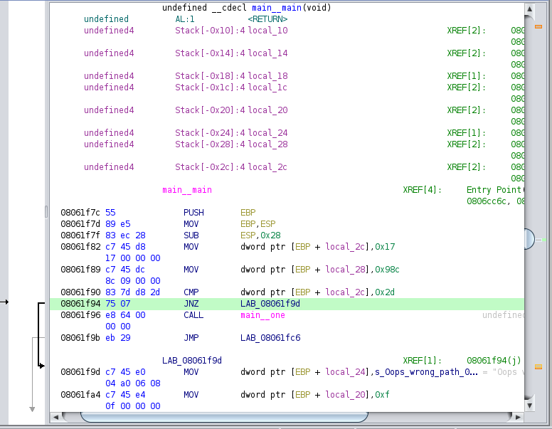

To get around this, use a hex editor of choice to patch the binary.
In my case, I chose to change the 0x2d to 0x17 with the tool "hexeditor"
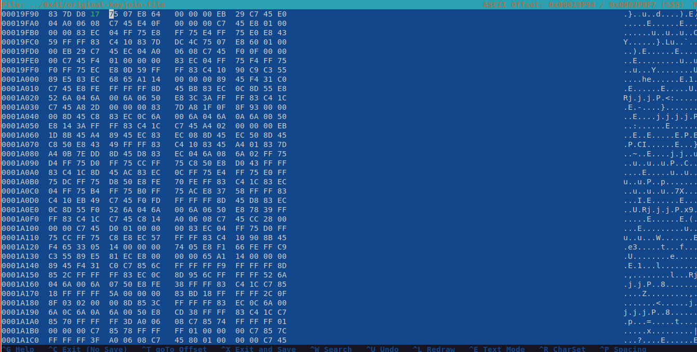

Next, go to main__one and look at the assembly.

A similar comparsion is made to trick ghidra into
thinking that the code we want to execute (with the flag) is dead code
(so it won't show up in the decompiler)

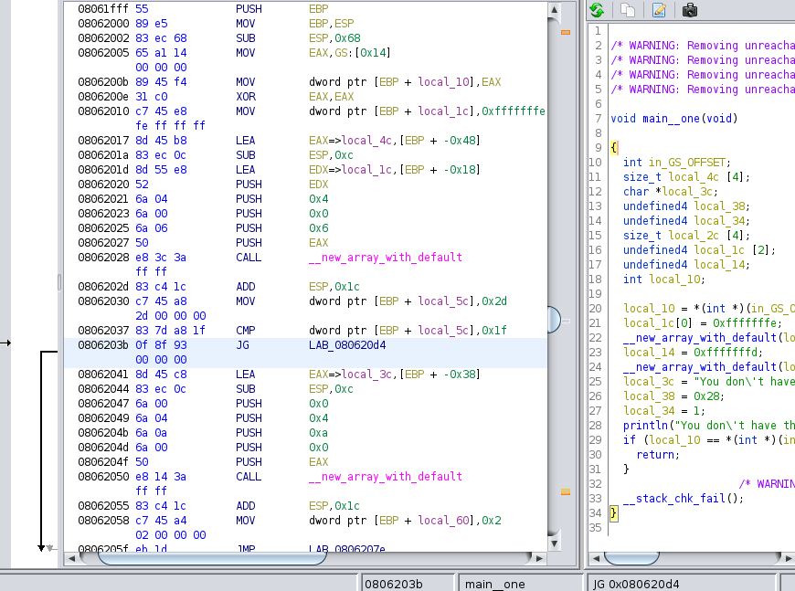
So, we need to change comparison so that it will return 0, executing the dead code.
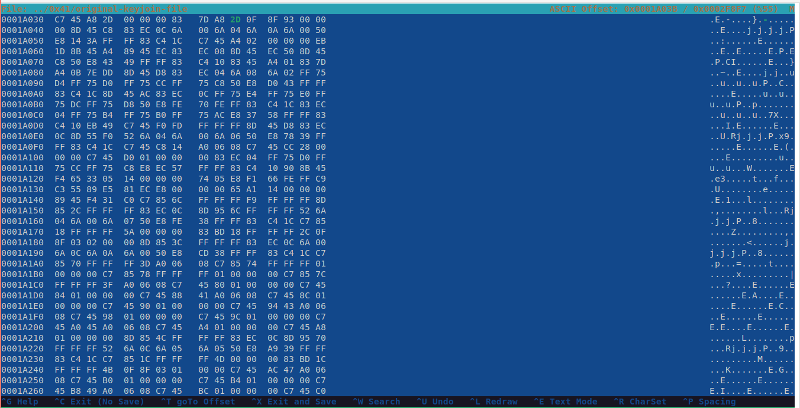

Do this again for main__two(), as shown here
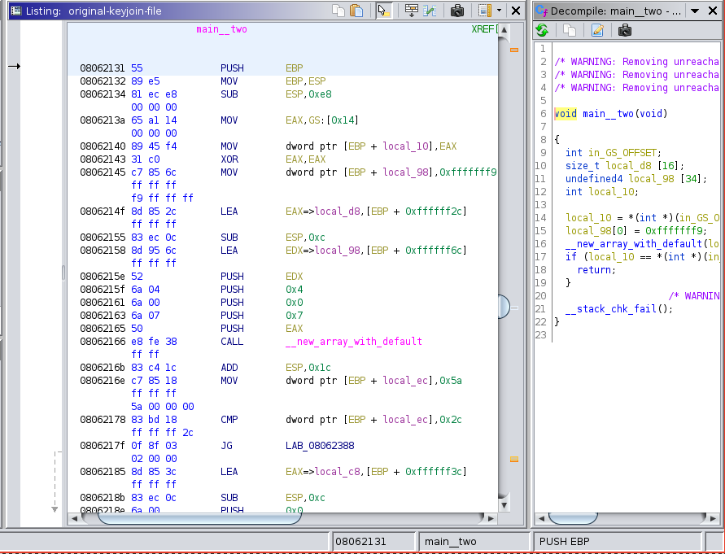

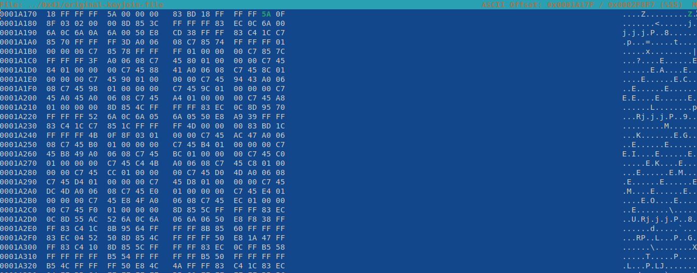

Finally, we must change the

```  MOV        dword ptr [EBP + local_28],0x98c``` 
to move 0x4c so that main__two() will be called

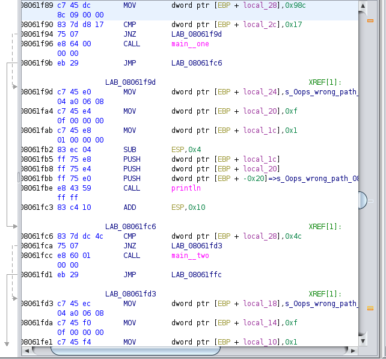
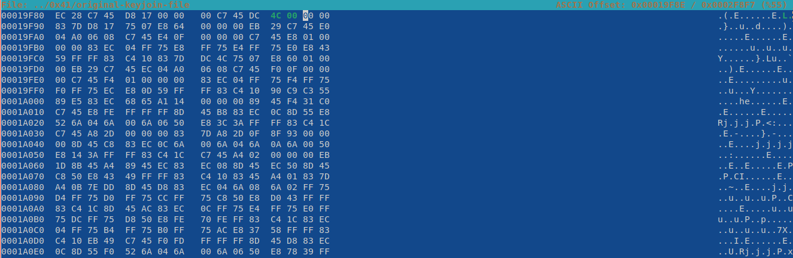

Assuming that you patched everything correctly, you can run this modified file
and it will print the flag:

```flag{456789JKLq59U1337}```

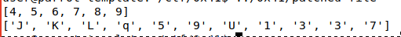


