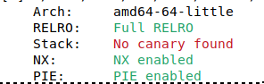
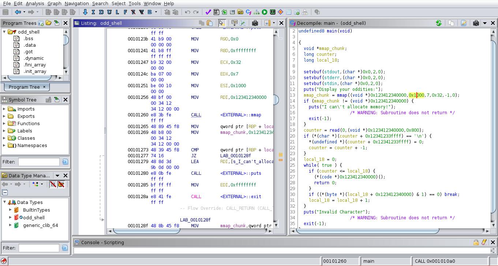
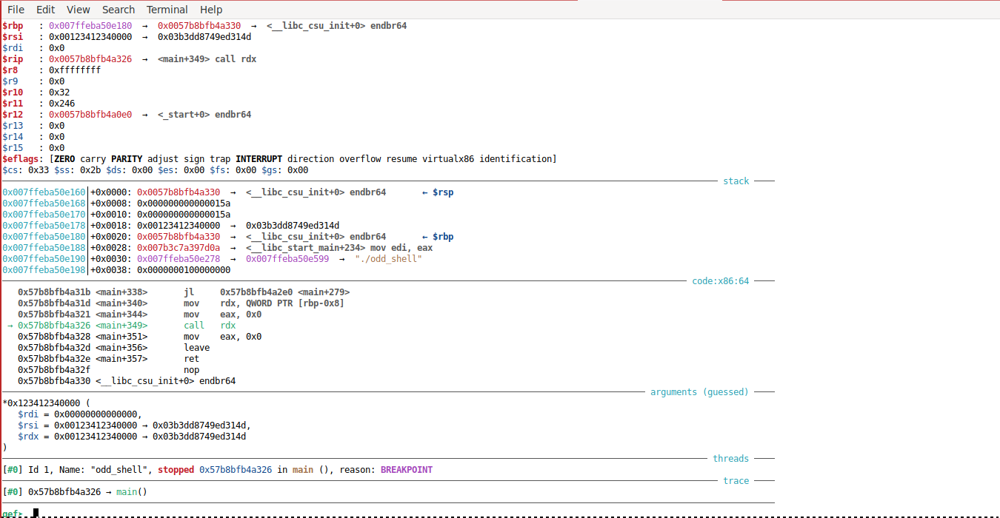
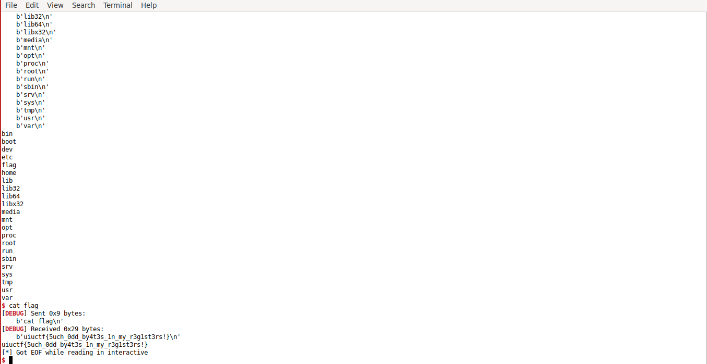

### Writeup for "odd shell"

Description: O ho! You found me! I have a display of oddities available to you!

author: Surg


Mitigations:

 


Loading the binary in ghidra, we see the following in main: 


The binary reads in our input to the mmap'd chunk, then executes
it ```(*(code *)0x123412340000)()```. 

The only catch is that every byte of
our shellcode must be an odd number (probably the reason for the challenge name, 'odd shell')


This has the effect of blocking important instructions like

```movabs rdi, <ascii value of /bin/sh>```

```mov rax, rdi```


Recall that in order to execve /bin/sh, we need the following conditions to be true

* RAX == 0x3b
* RDI == pointer to /bin/sh string
* RDX == NULL
* RSI == NULL

To get around these, I used some of the following substitute instructions for what was blocked:

* xchg instead of mov
* mov with a general purpose register like r15 instead of rax
* shr and ror (important for /bin/sh string)

Right before the shellcode is executed, observe that r15 == 0,
so we can use push/pop instructions or xchg w/a zero'd register to zero out other registers.

	

The most difficult part of the challenge IMHO was getting the ascii value for /bin/sh 
(0x68732f2f6e69622f)
in memory

Since 0x68 was a bad character, I followed this idea:

* r11 = 0x1
* ch (16 bits of rcx) = 0x67
* swap r11 and rcx
* 	(r11 = 0x6700, rcx = 0x1 )
* shift r11 8, so r11 = 0x67
* r11 = r11 + rcx, so r11 = 0x68
* ror r11 by 8, so r11 = 0x6800
* ror r11 so that r11 == 0x6800000000
* swap rdi with r11

Then, add the next 4 chars (0x732f2f2f6d) to rdi.
Note, we have to change the 0x6e from the target value
to 0x6d to avoid having an even byte.

This was fixed with a single ```inc``` instruction

* mov r13, 0x732f2f6d
* add r13, rdi (0x6800000000 +0x732f2f2f6d ) = 0x68732f2f2f6d
* inc r13 (r13 = 0x68732f2f2f6e)
* swap r13 and rdi

Next, we have to 'setup' a register so we can do a similar addition
process for the last piece. Since 0x62 was a bad byte, I used 0x61
in its place and fixed with ```inc``` similar to above. 0x1 is a dummy byte that will get lost in bit shifting. It was needed to prevent a null byte from appearing in the ```mov``` instruction.

(more pseudocode, read the script for full solution)

* mov r11, 0x69612f01
* swap r13 and rdi
* r13 (0x68732f2f2f6d) -> rotated 24 = 0x68732f2f6e000000 
* r11 = 0x69612f0100 >> 8 = 0x69612f01 -> ror 8 -> 0x010000000069612f 
* inc r11
* rotate + add r11 to r13, so r13 = 0x68732f2f6e69622f
* xchg r13 and rdi

### Setting up args

* Now that we have the /bin/sh value in RDI, all we have to do is push a zero'd out register, then push rdi and rsp. Then pop into RDI so we have a valid pointer.

* Setting up RAX for a system call was fairly straight forward. 0x3b is the syscall number for execve, so I just put a 0x3b3b3b3b value in a register and shifted it left to become 0x3b. Then, swap with RAX.


### Popping a shell

* At this point, I ran the script and was getting a shell locally, but not on remote. Googling the problem reminded me that I forgot to duplicate the server socket so my shell could use stdin/stdout correctly. The solution required me to invoke ```dup2(stdin/stdout/stderr, 0x4, 0x0)```. 

* I used 0x4 as the ```newfd``` argument for dup2. Not sure if you could use a higher number for the server socket, but it worked in my case.

* dup2's syscall number is 0x21, so I set up RAX similar to how I did for execve.

For stdin/stdout setup, the shellcode worked like this (high-level overview):

* RSI = newfd = 0x4
* RDI = 0x00/0x1,0x2 (stdin,stdout, and stderr respectively)
* RDX = NULL
* set RAX = 0x21, then syscall

So, before the setup for execve with /bin/sh, I added the series of dup2() calls.

Once that was done, challenge solved.





uiuctf{5uch\_0dd\_by4t3s\_1n\_my\_r3g1st3rs!}

