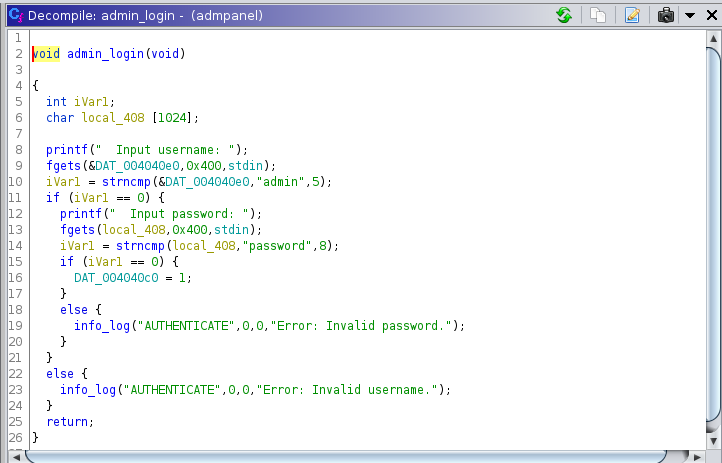
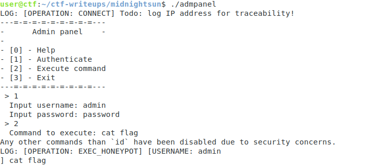
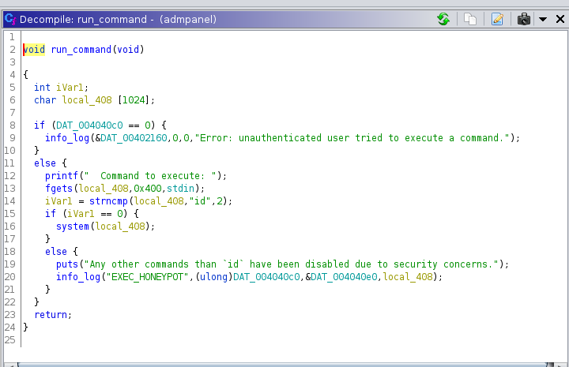
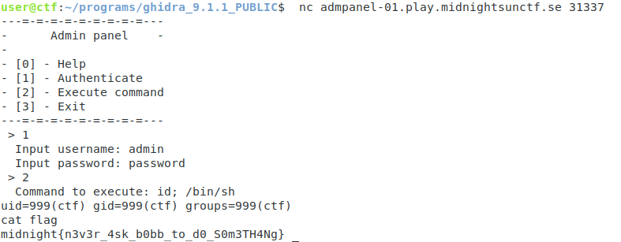

This challenge consists of a menu with the option to login as a user and run commands. 

As we see here, the login credentials are hardcoded as "admin" and "password"

When we press 2, we get an error message if the command is not "id"

Let's take a look at the code that executes this command and see where any holes may be

The fgets call reads 1024 characters into a size 1024 buffer, so no issue there.......

The hole here is the system() call at line 16. Since this buffer has user-supplied data being executed in a shell, it's a classic command injection vulnerability. So, by doing id; /bin/sh, we can pop a shell and get the flag. Lesson learned, don't blindly run user input :)

