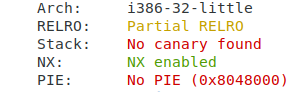
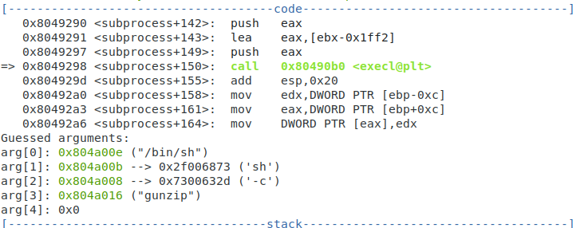
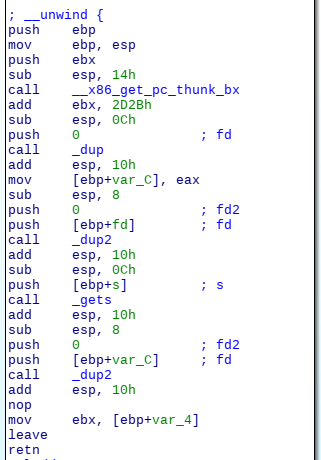
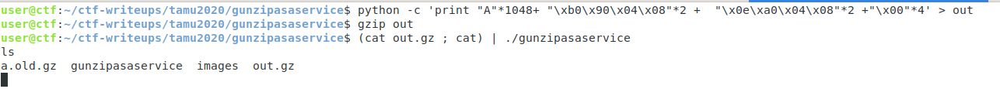

Before starting this one, let's see what kind of defenses are in play



Since we have no stack cookies, but nx stack, my first guess was ret2libc.

Our program takes a gzip file and gunzips it, so our exploit code must be contained in a gzipped file. Otherwise it will error.
The program forks and runs gzip in a child process.



I noticed that in reading the output back from the child, gets() is being called. 


That means that if we can overflow gets, we get control of EIP. What can we do with that? From the previous image, we have a hardcoded address for /bin/sh and execl(). So, if we call execl() with /bin/sh, we pop a shell. 

Our exploit will look something like this: A bunch of A's | Address of execl() | Junk | Address of /bin/sh | NULL. 

This comes out to the following code: 
``` python -c 'print "A"*1048+ "\xb0\x90\x04\x08"*2 +  "\x0e\xa0\x04\x08"*2 +"\x00"*4 ```
we then gzip it, feed it to the program, and.............Nothing. 

What happened for me is that my code would run and then exit cleanly. The problem with that is I need an interactive shell to type 'cat flag'. 
The solution to this is to run (cat exploit.gz; cat) | ./gunzipasaservice

I made this writeup after the CTF, so the server was not around for me to show the flag being printed :(
However, you can run this locally to verify that it works

 
