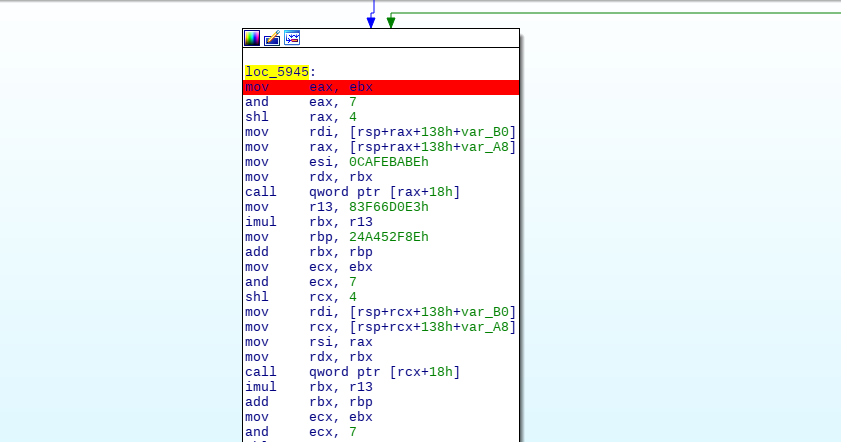
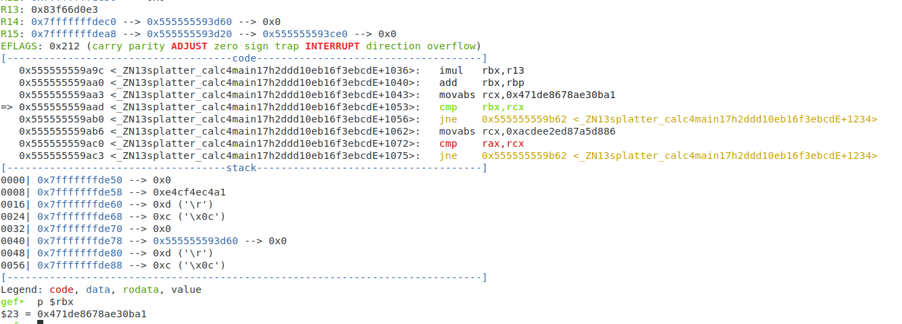

This challenge is pretty simple. We enter a number when prompted. And if the number is correct, then we win.
This is determined by a check if rbx = 0x471de8678ae30ba1 and if rax = 0xacdee2ed87a5d886
I noticed that the computation was being done toward the end of main()
Here's the start of them in IDA:

With odd-numbered steps, we call one function that does a few operations with rax and rsi. 
With even steps, we call a function that does some with rax, rsi, and rdx.

My thoughts when I saw this were to see if there was some way if I could replicate the steps that the binary was taking and if I could find the number that will get me to the desired result. Z3 is very powerful for problems like these. I used the guide from https://0xeb.net/2018/03/using-z3-with-ida-to-simplify-arithmetic-operations-in-functions/ to give me an idea of how we can set the steps up. I've never solved with Z3 before, so this was very helpful. 

My script spit out a number, 982730589345. 
And when we plug it in, it passes the check.

Once you run it on the remote server, you get the flag.
